<div align="center">

# 🧠 OpinionFlow — Vue 前端

**舆情分析与新闻聚合平台 · 前端**

[](https://vuejs.org/)
[](https://element-plus.org/)
[](https://echarts.apache.org/)
[](https://vitejs.dev/)
[](LICENSE)

</div>

---

## 📋 项目简介

OpinionFlow 前端是一个基于 **Vue 3** 的舆情分析与新闻聚合单页应用，配合 [OpinionFlow 后端](https://github.com/lebigpig/OpinionFlow) 微服务使用。核心功能包括：

- 📰 **多源新闻聚合** — 网易新闻、纽约时报、雅虎财经、实时财经快讯
- 🤖 **AI 自定义分析** — 支持多轮对话、对话记忆、历史记录管理
- 🔍 **智能搜索** — 集成 Tavily 搜索引擎，支持联网搜索与结果持久化
- 📊 **可视化图表** — 基于 ECharts 生成行业风险/机会指数、情绪饼图等
- 🐍 **脚本调度引擎** — 一键运行 Python 爬虫脚本，支持 SSE 实时日志流
- 💬 **股吧评论分析** — 对股票评论进行情绪分析、主题提取

---

## 🖼️ 界面展示

> 📸   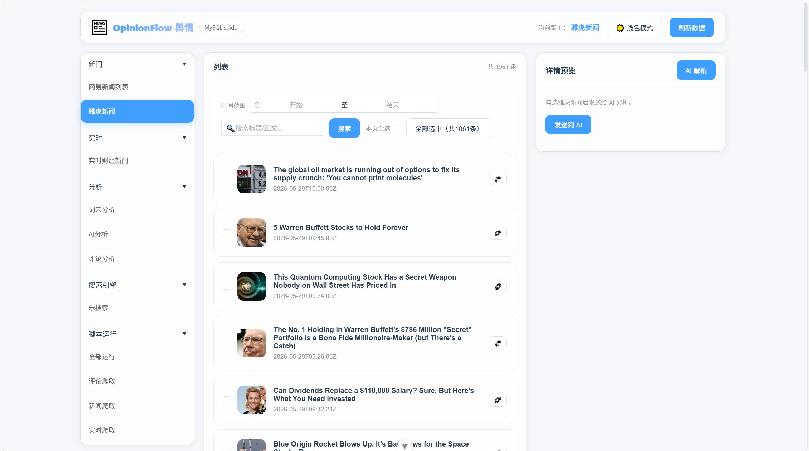 — 请替换为实际截图

<!-- 📸 截图标记：首页总览 -->
> **首页 / 导航布局**

<!-- 📸 REPLACE: 首页截图 -->


---

<!-- 📸 截图标记：网易新闻页面 -->
> **网易新闻 — 通用新闻聚合**

<!-- 📸 REPLACE: 网易新闻截图 -->


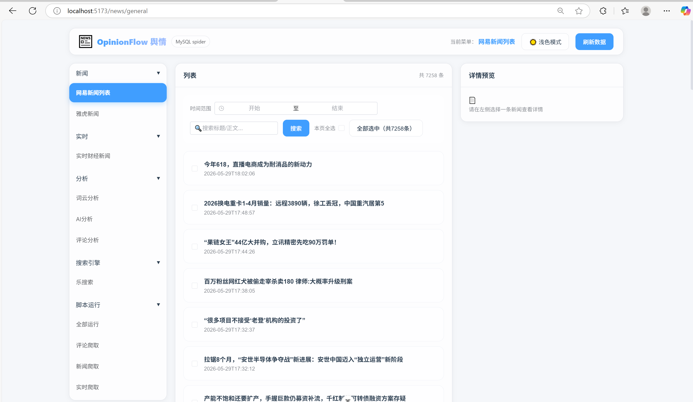

<!-- 📸 截图标记：实时财经快讯 -->
> **实时财经快讯**

<!-- 📸 REPLACE: 财经快讯截图 -->


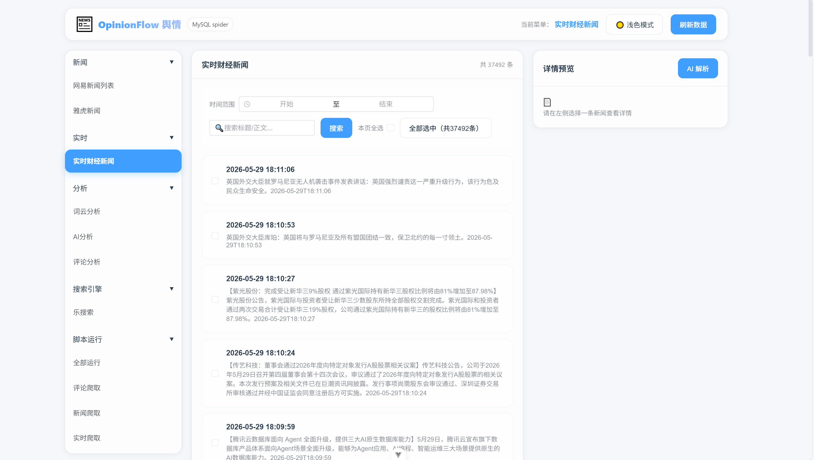 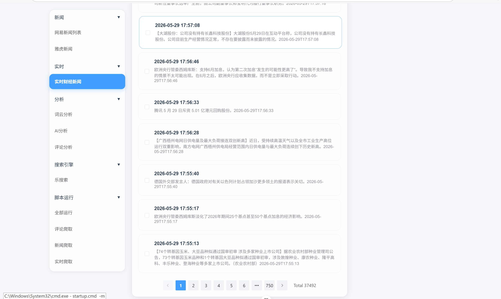

<!-- 📸 截图标记：雅虎财经新闻 -->
> **雅虎财经新闻**

<!-- 📸 REPLACE: 雅虎财经截图 -->


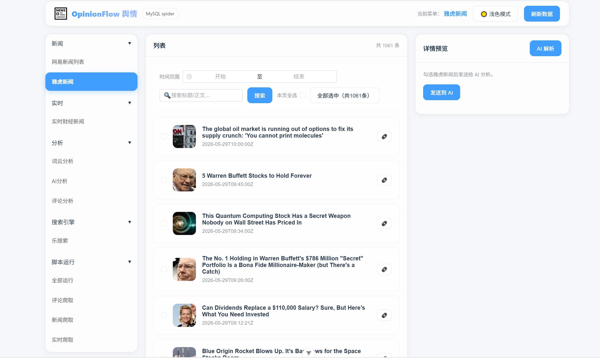 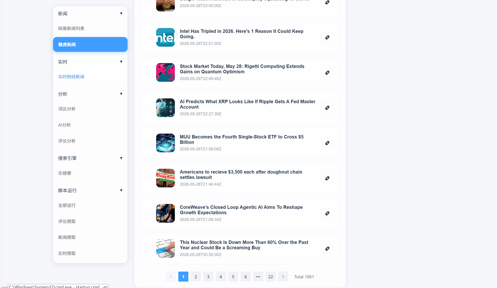


<!-- 📸 截图标记：AI 自定义分析页面 -->
> **AI 自定义分析 — 多轮对话 + 对话记忆**

<!-- 📸 REPLACE: AI 自定义分析截图 -->


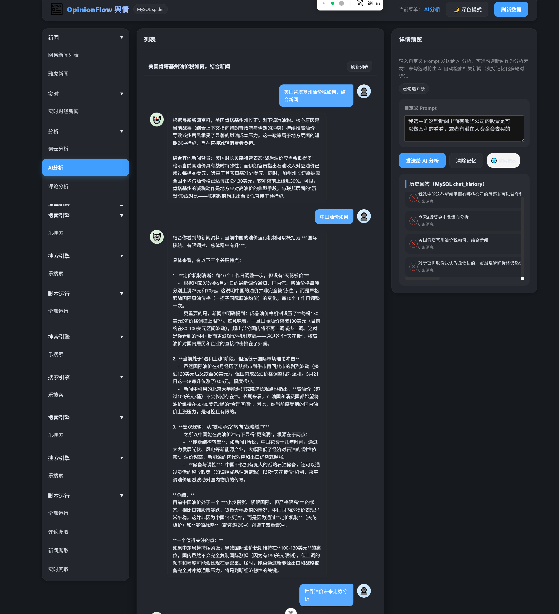

<!-- 📸 截图标记：行业分析页面 -->
> **行业分析 — 风险/机会指数可视化**

<!-- 📸 REPLACE: 行业分析截图 -->


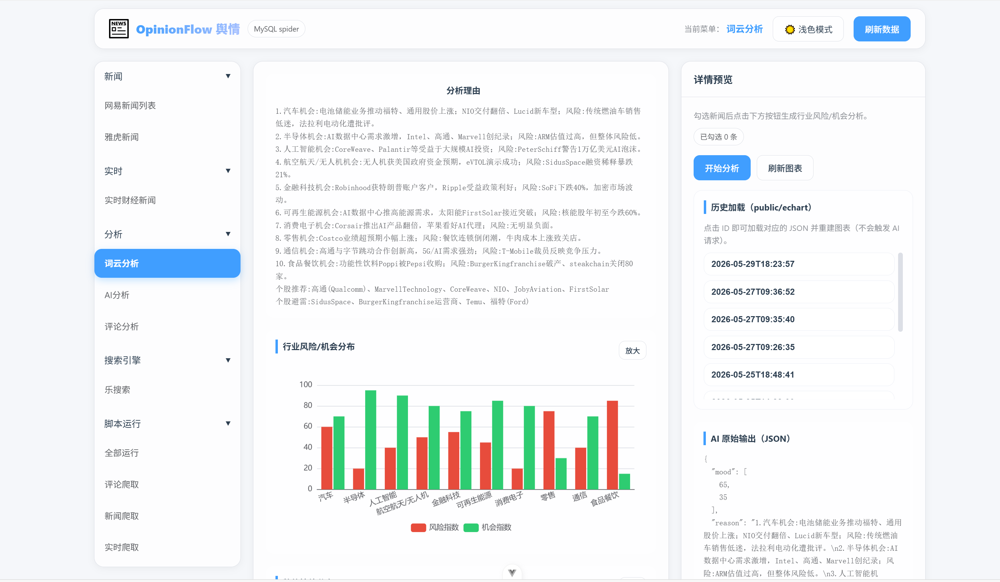 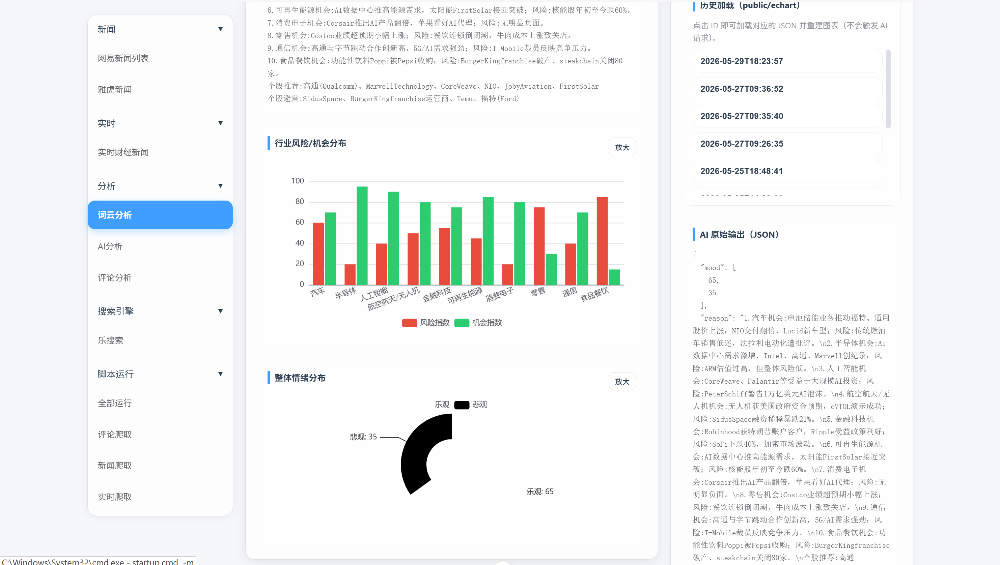

<!-- 📸 截图标记：股吧评论分析 -->
> **股吧评论分析 — 情绪分析与主题提取**

<!-- 📸 REPLACE: 评论分析截图 -->

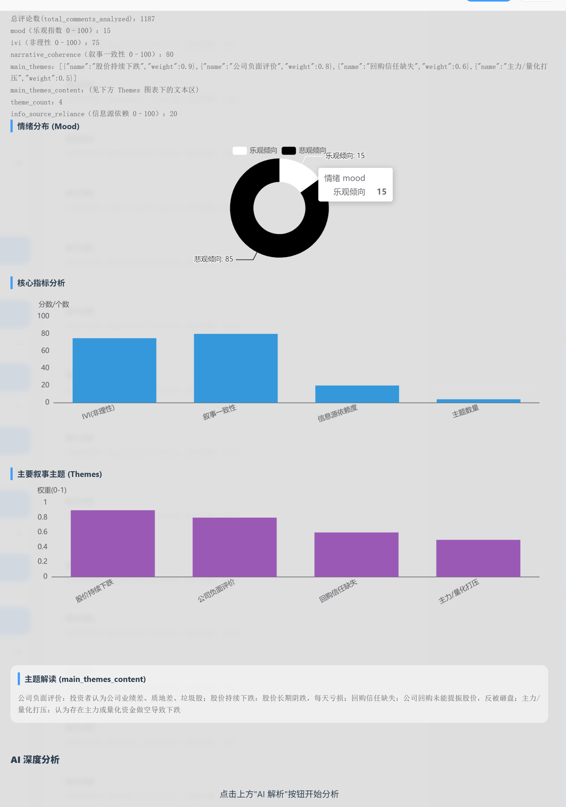   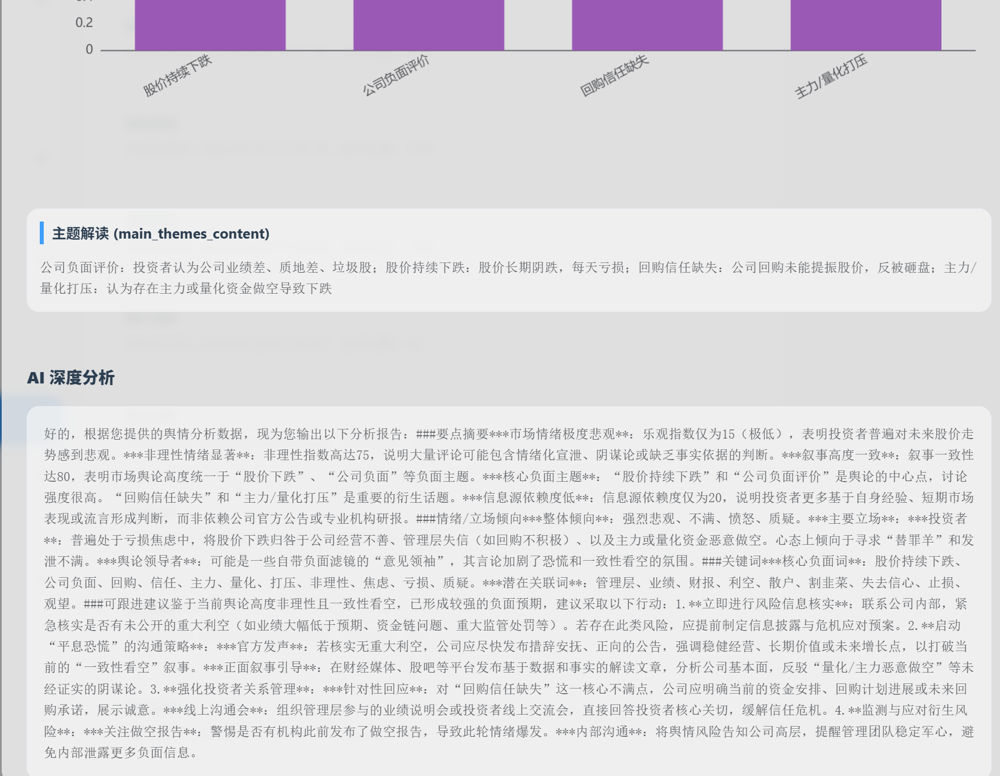
 
<!-- 📸 截图标记：智能搜索页面 -->
> **智能搜索 — Tavily 联网搜索**

<!-- 📸 REPLACE: 搜索截图 -->


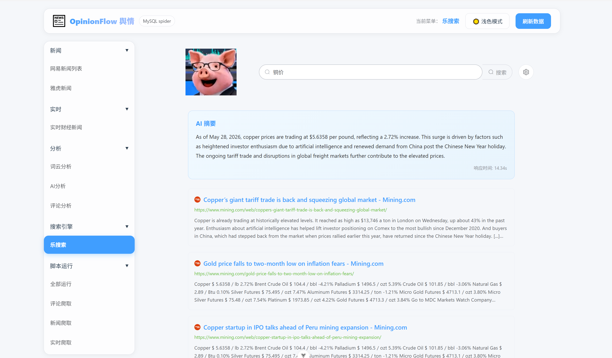 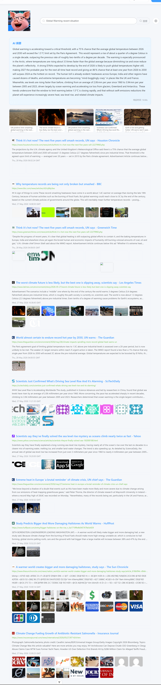

<!-- 📸 截图标记：脚本调度运行 -->
> **脚本调度 — Python 爬虫一键运行**

<!-- 📸 REPLACE: 脚本运行截图 -->


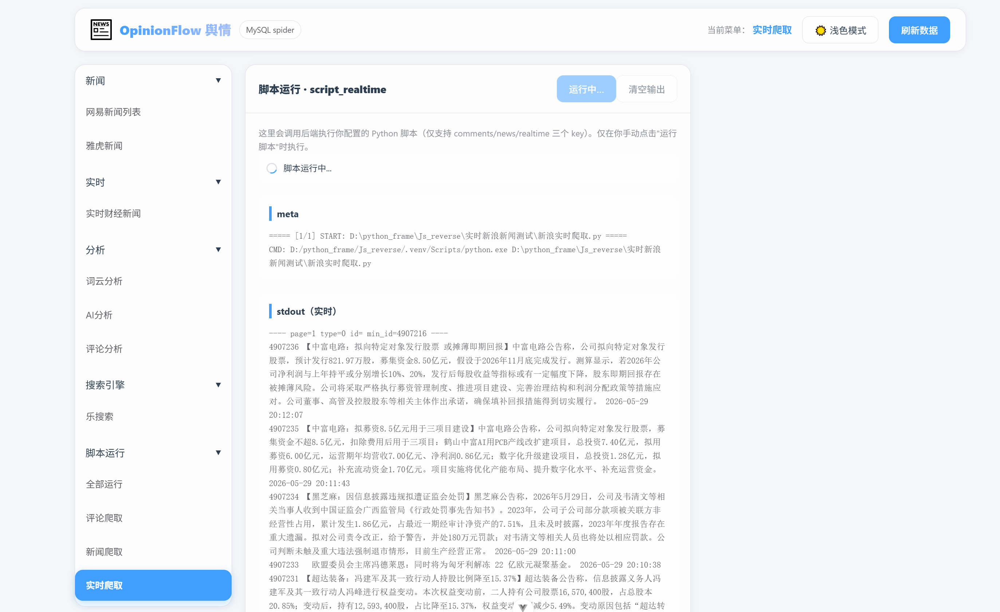

## 🏗️ 项目结构

```
opinionflow-vue/
├── public/
│   ├── favicon.ico
│   └── logo.svg
├── src/
│   ├── App.vue                 # 根组件
│   ├── main.js                 # 入口文件
│   ├── config.js               # 全局配置
│   ├── assets/                 # 静态资源 & 全局样式
│   │   ├── base.css
│   │   ├── global.css
│   │   ├── main.css
│   │   ├── logo.svg
│   │   └── pig.png
│   ├── components/
│   │   └── Filter/             # 筛选组件
│   ├── composables/
│   │   └── useTheme.js         # 主题切换（深色/浅色）
│   ├── layouts/
│   │   ├── MainLayout.vue      # 主布局框架
│   │   ├── header/             # 顶部导航栏
│   │   └── Right Sidebar/      # 右侧边栏
│   ├── lib/
│   │   └── api.js              # API 请求封装（Axios + SSE）
│   ├── moudle/
│   │   └── htmlToPlainText.js  # HTML 转纯文本工具
│   ├── router/
│   │   └── index.js            # Vue Router 路由配置
│   ├── stores/                 # Pinia 状态管理
│   │   ├── AiCustomStore.js    # AI 自定义分析状态
│   │   ├── DetailStore.js      # 详情页状态
│   │   ├── IndustryStore.js    # 行业分析状态
│   │   ├── NewsStore.js        # 新闻列表状态
│   │   └── ScriptStore.js      # 脚本调度状态
│   ├── views/                  # 页面视图
│   │   ├── GeneralNews.vue     # 网易新闻
│   │   ├── FinanceNews.vue     # 实时财经快讯
│   │   ├── YahooNews.vue       # 雅虎财经新闻
│   │   ├── Industryanalyse.vue # 行业分析（ECharts 图表）
│   │   ├── AICustomAnalysis.vue# AI 自定义分析（多轮对话）
│   │   ├── StockComments.vue   # 股吧评论分析
│   │   ├── SearchResults.vue   # 智能搜索（Tavily）
│   │   └── ScriptRun.vue       # 脚本调度运行
│   └── echart/                 # ECharts 图表 JSON 配置文件
├── package.json
├── vite.config.js
├── jsconfig.json
└── index.html
```

---

## 🚀 快速开始

### 环境要求

| 工具 | 版本要求 |
|------|---------|
| Node.js | ^20.19.0 或 >=22.12.0 |
| npm | 9+ |

### 1️⃣ 安装依赖

```bash
npm install
```

### 2️⃣ 启动开发服务器

```bash
npm run dev
```

前端默认启动在 `http://localhost:5173`，自动代理 `/api` 请求到后端 `http://localhost:8080`。

### 3️⃣ 构建生产版本

```bash
npm run build
```

构建产物输出到 `dist/` 目录。

---

## 📡 页面路由

| 路径 | 页面 | 说明 |
|------|------|------|
| `/` | 首页 / 网易新闻 | 通用新闻聚合列表 |
| `/finance` | 实时财经快讯 | 快讯新闻流 |
| `/yahoo` | 雅虎财经新闻 | Yahoo Finance 新闻 |
| `/industry` | 行业分析 | ECharts 风险/机会指数图表 |
| `/ai-custom` | AI 自定义分析 | 多轮对话 + 对话记忆 |
| `/comments` | 股吧评论分析 | 情绪分析与主题提取 |
| `/search` | 智能搜索 | Tavily 联网搜索 |
| `/scripts` | 脚本调度 | Python 爬虫运行 |

---

## 🎨 主题切换

OpinionFlow 支持 **深色 / 浅色** 主题切换，通过 `composables/useTheme.js` 实现：

<!-- 📸 截图标记：深色模式 -->
> **深色模式效果**

<!-- 📸 REPLACE: 深色模式截图 -->

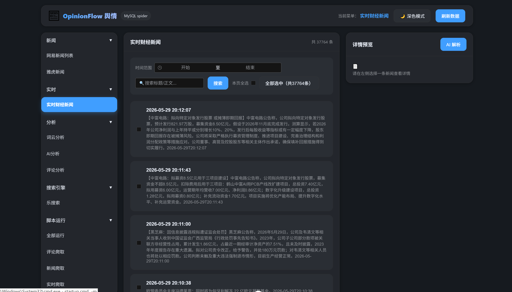

<!-- 📸 截图标记：浅色模式 -->
> **浅色模式效果**

<!-- 📸 REPLACE: 浅色模式截图 -->


---

## 📊 ECharts 图表

行业分析页面使用 ECharts 6 生成交互式图表，包括：

- 📈 **行业风险指数** — 柱状图/雷达图
- 🎯 **行业机会指数** — 对比分析
- 🥧 **情绪分布饼图** — 正面/中性/负面占比
- 📉 **趋势折线图** — 舆情走势

<!-- 📸 截图标记：ECharts 图表 -->
> **ECharts 图表效果**

<!-- 📸 REPLACE: 图表截图 -->


---

## 🛠️ 技术栈

| 技术 | 用途 |
|------|------|
| **Vue 3** | 前端框架（Composition API） |
| **Pinia** | 状态管理 |
| **Vue Router** | 路由管理 |
| **Element Plus** | UI 组件库 |
| **ECharts 6** | 数据可视化 |
| **Axios** | HTTP 请求 |
| **Vite** | 构建工具 |
| **SSE** | 服务端推送（AI 流式输出 / 脚本日志） |

---

## 🔧 代理配置

开发环境下，`vite.config.js` 自动将 `/api` 请求代理到后端：

```js
// vite.config.js
server: {
  proxy: {
    '/api': {
      target: 'http://localhost:8080',
      changeOrigin: true,
    }
  }
}
```

生产环境请配置 Nginx 等反向代理，将 `/api` 转发到后端网关地址。

---

## ⚠️ 注意事项

1. **后端依赖**：前端需要配合后端微服务使用，请先启动 [OpinionFlow 后端](https://github.com/lebigpig/OpinionFlow)
2. **网关地址**：开发环境默认代理到 `http://localhost:8080`（Gateway 网关端口），如需修改请编辑 `vite.config.js`
3. **SSE 流式**：AI 分析和脚本运行使用 SSE 实时推送，确保后端正确配置 CORS
4. **Node.js 版本**：请使用 `^20.19.0` 或 `>=22.12.0`，低版本可能不兼容

---

## 📄 开源协议

本项目基于 MIT 协议开源，详见 [LICENSE](LICENSE) 文件。